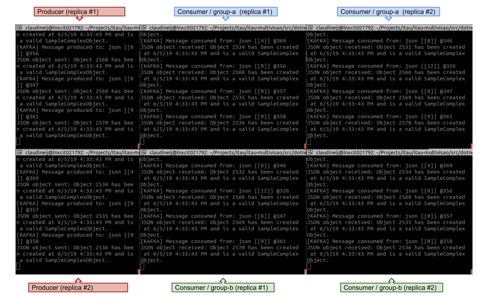

# .NET Kafka
A sample application that interacts with Apache Kafka from .NET Core using the Conluent's .NET Client.

## Prerequisites
- [.NET Core SDK 2.2](https://dotnet.microsoft.com/download)
- [A local Kafka Cluster](../../infrastructure/README.md)
- Optionally a code editor like [VS Code](https://code.visualstudio.com/) with the [C#](https://marketplace.visualstudio.com/items?itemName=ms-vscode.csharp) and [.NET Core Test Explorer](https://marketplace.visualstudio.com/items?itemName=formulahendry.dotnet-test-explorer) extensions.

## Creating the topics
The application uses 3 Kafka topics: "text", "json" and "binary".

It is suggested that you create them through Kafka Manager before the first usage so that you can set the replication factor and number of partitions. Go to **[Kafka Manager UI](http://kafka-manager.itau.ep:9000/) > kafka-local > Topic > Create** and create the 3 topics.

**Example**: when setting a replication factor of 3 and 15 partitions, each node will own 5 partitions and replicate the remaining 10 partitions owned by the other nodes.

## Application use cases
- **produce-text**: Run a producer that generates text objects (strings) and sends them to the "text" topic.
- **consume-text**: Run a consumer that reads text objects from the "text" topic.
- **produce-json**: Run a producer that generates JSON objects and sends them to the "json" topic.
- **consume-json**: Run a consumer that reads JSON objects from the "json" topic.
- **produce-binary**: Run a producer that reads binary files from a specified directory and sends them to the "binary" topic.
- **consume-binary**: Run a consumer that reads binary files from the "binary" topic and writes them to a specified directory.

## Application usage
The **DotNetKafka.ConsoleApp** project is the application entrypoint. Command line arguments are used to customize the execution. Run the console application without arguments to see a complete usage documentation. In other words, a simple ...
```
dotnet run
```

... will display:
```
Usage:
    .. --use=<option> [--elem=<num>] [--group=<name>] [--in=<dir>] [--out=<dir>]

Options:
    --use       Options: produce-text, consume-text, produce-json, consume-json, produce-binary, consume-binary
    --elem      Number of elements (for text and json use cases) to generate and produce (default: 1000)
    --group     Consumer group name (default: default-group)
    --in        Input directory to read binary files from (default: <project_root>/.static/input)
    --out       Output directory to write binary files to (default: <project_root>/.static/output)
```

### Examples
Running the "produce-text" use case:
```
dotnet run --use=produce-text
```

Running the "produce-json" use case, producing 800.000 objects:
```
dotnet run --use=produce-json --elem=800000
```

Running the "produce-binary" use case, reading all binary files from /home/my-files/:
```
dotnet run --use=produce-binary --in /home/my-files/
```

Running the "consume-json" use case, assigning to consumer group the "group-a":
```
dotnet run --use=consume-json --group=group-a
```

### Scaling
It is possible to scale multiple parallel producers or consumers. For example, you can run 2 consumer replicas of "group-a" and other 2 replicas of "group-b", consuming messages from 2 producers replicas.



## Running the tests
There are examples of unit tests for all Kafka-related classes in the solution. Run them either from VS Code (**VS Code > "Test" icon > Run all tests**) or the CLI:
```
dotnet test
```

### Resilience and fault tolerance
#### For the producer
If a message fails to be delivered to a topic, Kafka will retry it up to 3 times before failing.

#### For the consumer
If a message fails to be read from a topic, an error will be logged to the console. On the other hand, if a message is effectively read the application must guarantee it isn't lost due to failures in intermediate processing actions.

Thus, once a message is read, a fault tolerance policy is set to retry the processing action up to 3 times. If none of them succeed, the message is sent as-is to a dead-letter topic (named **\_dead-letter\_\<name-of-topic\>**).

## Notes
- When running any **consume-*** use case, the application remains up and listening for future incoming messages. You can stop it by sending a **Control-C** command on the terminal.
- When running any ***-binary** use case, the maximum message size is 1Mb, although this value can be changed in producer/consumer configurations.